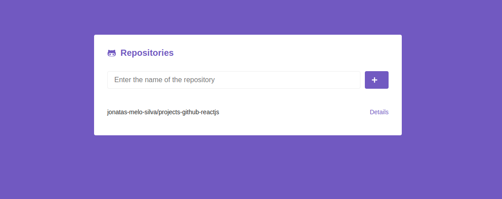
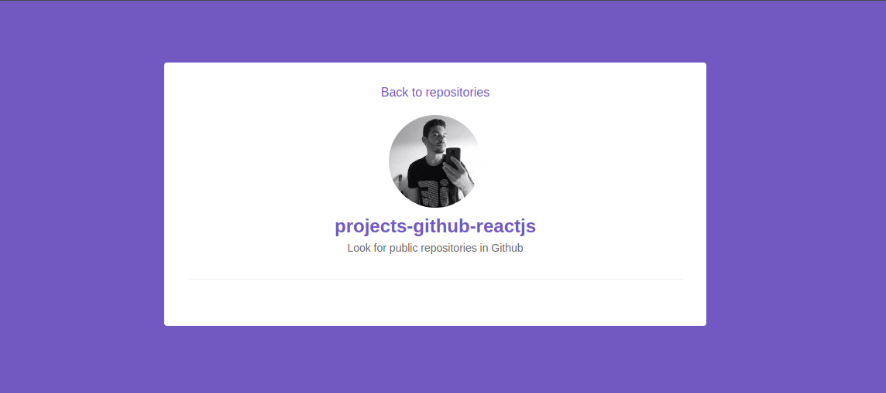

<header>
  <h1 align="center" >Projects Github</h1>

  <h4 align="center" >Look for public repositories in Github</h4>

  <br>

  <h2 align="center">Appendix</h2>

  <nav align="center">
    <a align="center" href="#features">Features</a> |
    <a align="center" href="#screenshots">Screenshots</a> |
    <a align="center" href="#tech-stack">Tech Stack</a> |
    <a align="center" href="#pre-requirements">Pre Requirements</a> |
    <a align="center" href="#running-the-local-project">Running the local project</a> |
    <a align="center" href="#licence">Licence</a> |
    <a align="center" href="#authors">Authors</a>
  </nav>
</header>

<br>

<h4 align="center">👨‍💻️  Construction  🚧️  project  🚀️</h4>

<hr>

<main>
  <section id="features" align="center">
    <h2 align="center">Features</h2>

- [x] List Repositories
- [x] Search Repositories
- [x] Details of the Repository
- [ ] Remove of the Repository

  </section>

  <br>
  <hr>

  <section id="screenshots" align="center">
    <h2 align="center">Screenshots</h2>

    <h4 align="center">Página Home</h4>
    <h2></h2>

    <hr>

    <h4 align="center">Página Repository</h4>
    <h2></h2>

  </section>

  <br>
  <hr>

  <section id="tech-stack" align="center">
    <h2 align="center">Tech Stack</h2>
    <nav>
      <a align="center" href="https://www.npmjs.com/package/react">React</a> |
      <a align="center" href="https://www.npmjs.com/package/react-dom">React-Dom</a> |
      <a align="center" href="https://www.npmjs.com/package/react-icons">React-Icons</a> |
      <a align="center" href="https://www.npmjs.com/package/react-router-dom">React-Router-Dom</a> |
      <a align="center" href="https://www.npmjs.com/package/react-scripts">React-Scripts</a> |
      <a align="center" href="https://www.npmjs.com/package/web-vitals">Web-Vitals</a> |
      <a align="center" href="https://www.npmjs.com/package/styled-components">Styled Componentes</a> |
      <a align="center" href="https://www.npmjs.com/package/axios">Axios</a>
      </nav>
  </section>

  <br>
  <hr>

  <section id="pre-requirements" align="center">
    <h2 align="center">Pre-requeriments</h2>
    <p align="center">Before you begin, you will need to have installed on your machine the following tools
      <a href="https://git-scm.com/">Git</a>, <a href="https://nodejs.org/en/">Node.js</a>.
    </p>
    <p align="center">In addition it is good to have a text editor to work with the code, such as
      <a href="https://code.visualstudio.com/">VSCode</a>.
    </p>
  </section>

  <br>
  <hr>

  <section id="running-the-local-project" align="center">
    <h2 align="center">Running the local project</h2>

```bash
# Clone the repository
$ git clone <https://github.com/jonatas-melo-silva/projects-github-reactjs.git>

# Access the project folder in the terminal/cmd
$ cd projects-github-reactjs

# instaleAsDependencies
$ yarn

# Execute the Project in Development Mode
$ yarn start

# The server will start port:3000 - Go <http://localhost:3000>
```

  </section>

  <br>
  <hr>

  <section id="licence" align="center">
    <h2 align="center">Licence</h2>
    <p align="center">This project is licensed under the MIT license.</p>

[MIT](https://choosealicense.com/licenses/mit/)

  </section>

  <br>
  <hr>

  <section id="authors" align="center">
    <h2 align="center">👨‍💻️ Authors 🇧🇷</h2>

Made with 💜️ by 👦️ [@jonatas-melo-silva](https://github.com/jonatas-melo-silva)

  </section>
</main>
